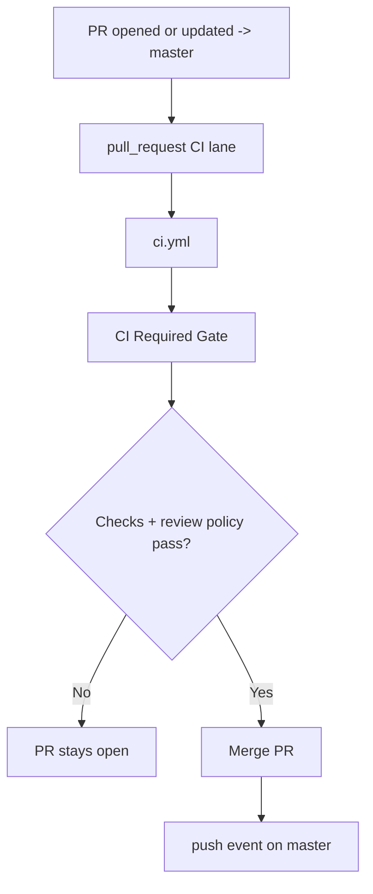
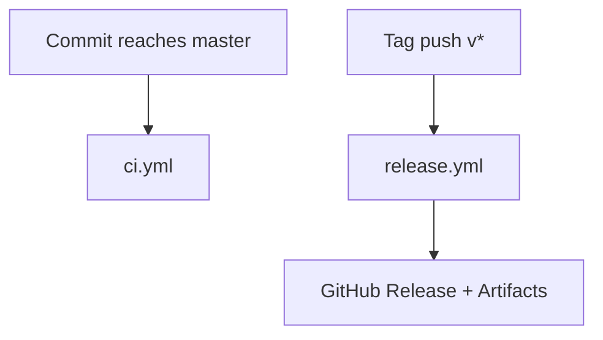

# Master Branch Delivery Flows

This document explains what runs when code is proposed to `master` and released.

Use this with:

- [`docs/ci-map.md`](../../docs/ci-map.md)
- [`docs/pr-workflow.md`](../../docs/pr-workflow.md)
- [`docs/release-process.md`](../../docs/release-process.md)

## Branching Model

ZeroClaw uses a single default branch: `master`. All contributor PRs target `master` directly.

Current maintainers: `theonlyhennygod`, `jordanthejet`, and `chumyin`.

## Event Summary

| Event | Main workflows |
| --- | --- |
| PR activity (`pull_request`) | `ci.yml` |
| Push to `master` | `release-build.yml` (on push) |
| Tag push (`v*`) | `release.yml` |
| Scheduled/manual | `ci-full.yml`, `ci-canary-gate.yml`, `ci-provider-connectivity.yml`, etc. |

## Step-By-Step

### 1) PR from branch -> `master`

1. Contributor opens or updates PR against `master`.
2. `pull_request` CI workflows start:
   - `ci.yml` runs `test` and `build` jobs.
3. CI Required Gate aggregates results.
4. Maintainer merges PR once checks and review policy are satisfied.
5. Merge emits a `push` event on `master`.

### 2) Release

1. Tag push `v*` triggers `release.yml`.
2. Release artifacts are built and published to GitHub.

## Mermaid Diagrams

### PR to Master

### Release

